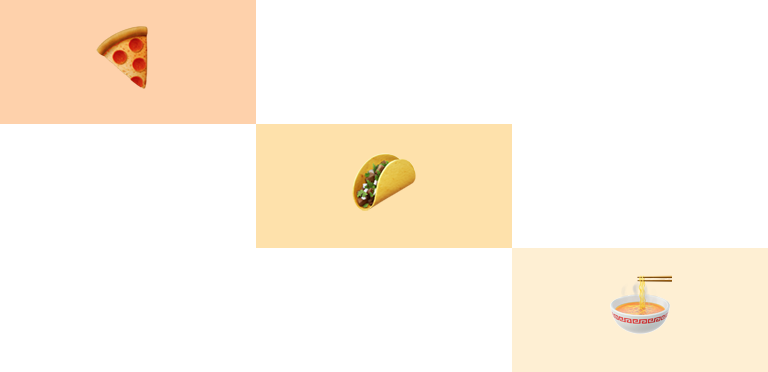
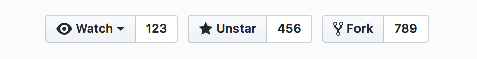
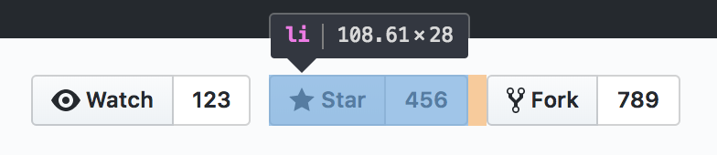
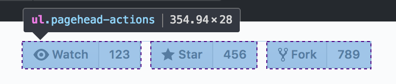

# layup

A tiny React helper for CSS layout using
[named areas and lines](https://developer.mozilla.org/en-US/docs/Web/CSS/CSS_Grid_Layout/Layout_using_Named_Grid_Lines)
from CSS Grid.

**Adaptable to any React styling solution.** Includes adapters for:

* [styled-components][]
* [Emotion][]
* [glamor][]
* inline styles – no additional library necessary!

## Install

Currently in beta.

```console
$ yarn add layup@next
```

```console
$ npm install --save layup@next
```

## Looks like…

(Using inline styles – but see below for more examples.)

<table>
<tbody>
<tr>
<td>

```jsx
import Layout from 'layup/inline'

const foodLayout = {
  gridTemplateAreas: `
    'pizza .     .    '
    '.     tacos .    '
    '.     .     ramen'
  `
}

<Layout style={foodLayout} areas={{
  pizza: <Pizza />,
  tacos: <Tacos />,
  ramen: <Ramen />
}} />
```

</td>
<td>



</td>
</tr>
</tbody>
</table>

## Motivation

* Many React layout components have you define your sizing, alignment, and
  spacing via props. This makes responsive design harder. (It’s why
  [Styled System](https://github.com/jxnblk/styled-system) has to support array
  values for every prop, for example.) Defining as much layout in CSS as
  possible lets you move things around via standard CSS features like `@media`
  queries – the layout isn’t “stuck” in JavaScript.
* You shouldn’t have to add individual styling properties (like `mb` or
  `marginBottom`) to every component you write just because there’s different
  whitespace around them sometimes.
* Using the `margin` property for layout is often arbitrary and doesn’t make
  sense for UI layout. Only in rare circumstances should UI elements own the
  whitespace separating them.

### What’s wrong with margin?

**Strong opinion time!** Using the `margin` property never made sense in the web
app/component world. It’s a relic from the very first version of CSS, when we
were laying out paragraphs of text in 1997. CSS Grid antiquates this practice.
People just haven’t caught on yet.

Examples? OK.

Suppose each of these “page actions” on GitHub were a component:



How do you think the spacing between them is defined? Maybe they’re each inside
a container with padding. Maybe they each have a left margin of 10px. Maybe they
each have a right margin of 10px, except for the `:last-child` which has 0. (In
this case, the latter is exactly what GitHub has done.)



Which method is “correct”? Well, none in particular. When you’ve been writing
CSS for a long time, you just develop an intuition for this. It could depend on
what other page elements are nearby. But mostly, it’s arbitrary.

But why do the individual components need to “own” the whitespace between them?
What if they’re used in other contexts that call for different spacing? Are we
just supposed to override their margins every time? Wouldn’t it be nice if the
component’s styles stopped at its actual borders, making it easier to use in
other places?

CSS Grid offers a new solution to this problem. In this case, the container
element can define the spacing between its children. It’s an inversion of the
usual method of controlling whitespace, and one that (in my opinion) makes more
sense. The children don’t need to concern themselves with spacing.

```css
.PageActions {
  display: grid;
  grid-auto-flow: column;
  grid-gap: 10px;
}
```



What if the spacing between elements isn’t constant? Take this screen from
[dribbble](https://dribbble.com/) for example:


How is that spacing defined?


Instead of each of those elements worrying about the overall layout, we could
leave them margin-less and have the container lay them out with CSS Grid like
so:

```css
.SignUp {
  grid-template-rows:
    [twitter] auto
    10px
    [facebook] auto
    10px
    [google] auto
    15px
    [orSeparator] auto
    15px
    [email] auto
    30px
    [signIn];
}
```

The container element is then free to arrange these rows differently (even
showing them in a different order) at different breakpoints. All the child
elements need to do is define their `grid-row` name. This library is a helper
for doing exactly that!

## Usage

The `Layout` component accepts `areas`, `columns`, and `rows` props. You should
only pass one of these. The value can be an object directly mapping area/line
names to child components:

```jsx
<Layout
  rows={{
    header: <Title>Leave a comment</Title>,
    body: <TextInput />,
    footer: <SubmitButton />
  }}
/>
```

…or an array that will be used to pair area/line names with the `children`
passed to `Layout`:

```jsx
<Layout rows={['header', 'body', 'footer']}>
  <Title>Leave a comment</Title>
  <TextInput />
  <SubmitButton />
</Layout>
```

How you define the actual layout of the areas/columns/rows depends on your
styling solution. Examples follow.

### …with [styled-components][]

`Layout` and its children receive their styling from `className`. Define the
grid layout using `styled()`:

```jsx
import Layout from 'layup/styled'

const FoodLayout = styled(Layout)`
  grid-template-areas:
    'pizza .     .    '
    '.     tacos .    '
    '.     .     ramen';
`

<FoodLayout areas={{
  pizza: <Pizza />,
  tacos: <Tacos />,
  ramen: <Ramen />
}} />
```

### …with [Emotion][]

`Layout` and its children receive their styling from `className`. Either use
`styled()` (see the styled-components example above) or define the grid layout
using `css`:

```jsx
import Layout from 'layup/emotion'
import { css } from 'emotion'

const foodLayout = css`
  grid-template-areas:
    'pizza .     .    '
    '.     tacos .    '
    '.     .     ramen';
`

<Layout className={foodLayout} areas={{
  pizza: <Pizza />,
  tacos: <Tacos />,
  ramen: <Ramen />
}} />
```

### …with [glamor][]

`Layout` and its children receive their styling from `className`. Define the
grid layout using `css`:

```jsx
import Layout from 'layup/emotion'
import { css } from 'glamor'

const foodLayout = css({
  gridTemplateAreas: `
    'pizza .     .    '
    '.     tacos .    '
    '.     .     ramen'
  `
})

<Layout className={foodLayout} areas={{
  pizza: <Pizza />,
  tacos: <Tacos />,
  ramen: <Ramen />
}} />
```

### …with inline styles

Layout receives its styling from `style`. Children must also support the `style`
prop:

```jsx
import Layout from 'layup/inline'

const foodLayout = {
  gridTemplateAreas: `
    'pizza .     .    '
    '.     tacos .    '
    '.     .     ramen'
  `
}

<FoodLayout style={foodLayout} areas={{
  pizza: <Pizza />,
  tacos: <Tacos />,
  ramen: <Ramen />
}} />
```

**…with any styling solution:**

All you need to do is define two components: Grid and Cell. Pass them to the
`createLayout` function to get your Layout component.

**Grid** should:

* Render an element with `display: grid` styling pre-applied.
* Render its `children`, which will be an array of Cell elements.
* Apply any further styling received from Layout. This is how users will
  customize the grid layout CSS.
  * You can do this via a prop like `className` or `style`, for example – it
    depends on your styling solution.

**Cell** should:

* Return a clone of its `child` prop using `React.cloneElement`. `child` will be
  one of the components passed to Layout.
  * Note that because it returns a clone, from the perspective of CSS, the
    children passed to Layout _are_ the grid cells (they aren’t _wrapped by_
    grid cells).
* Apply `grid-area`, `grid-column`, or `grid-row` styling to the cloned child
  based on the received `area`, `column`, or `row` prop, respectively.
  * You can apply these styles via a prop like `className` or `style`, for
    example – it depends on your styling solution. The only requirement is that
    the child components must support that prop.

See the [styled-components adapter](src/styled.js) for an example.

[styled system]: https://github.com/jxnblk/styled-system
[styled-components]: https://www.styled-components.com/
[emotion]: https://emotion.sh/
[glamor]: https://github.com/threepointone/glamor
